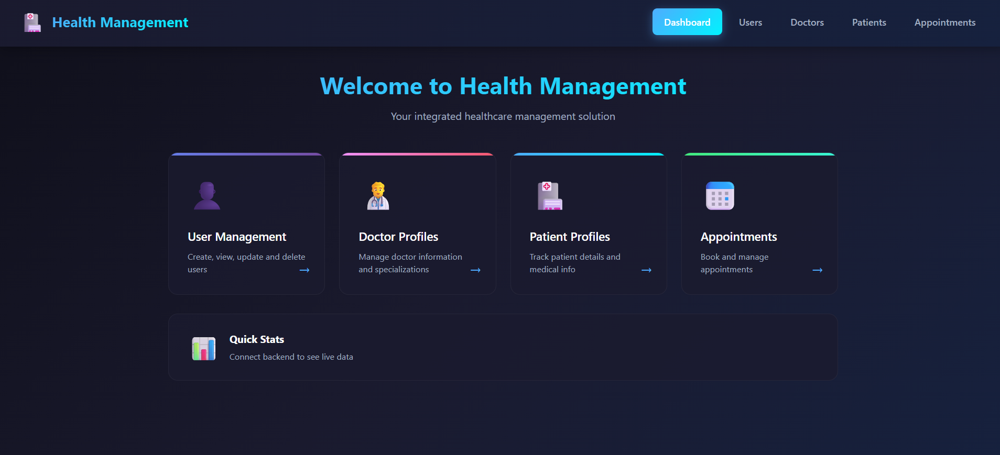
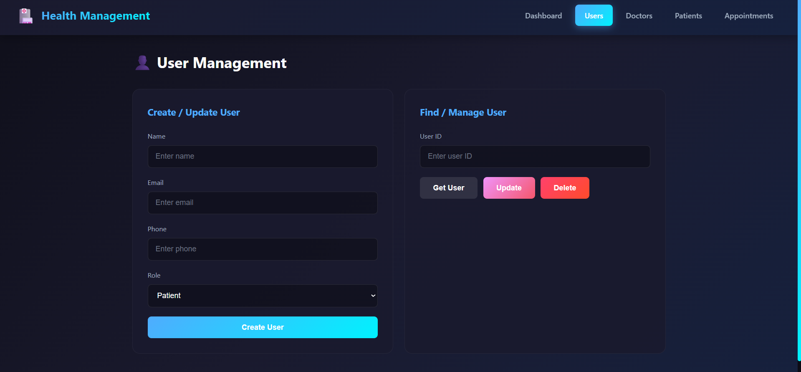
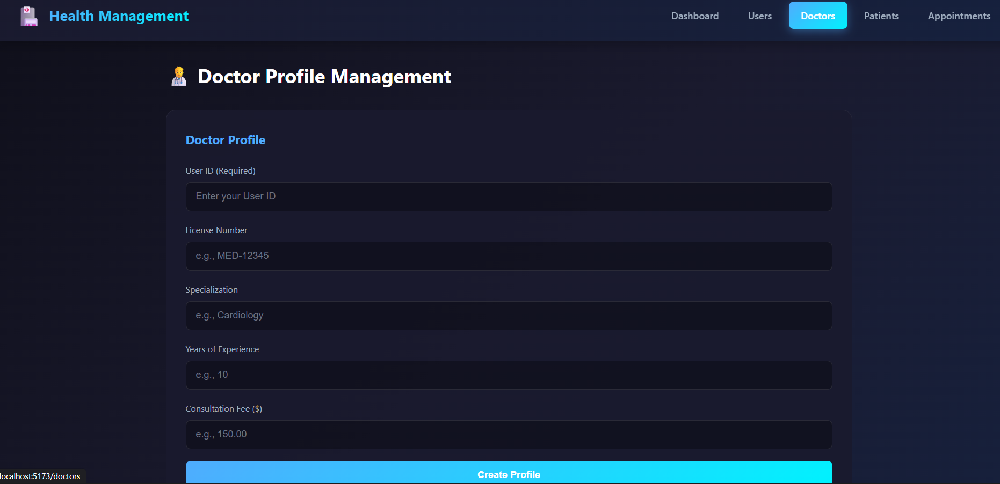
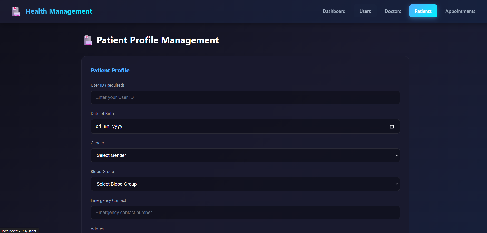
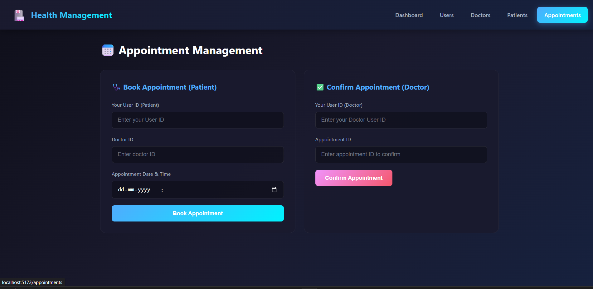

# 🏥 Integrated Health Management System

A full-stack healthcare management application built with **Spring Boot** (backend) and **React** (frontend).

## 📋 Table of Contents

- [Overview](#overview)
- [Tech Stack](#tech-stack)
- [Project Structure](#project-structure)
- [Features](#features)
- [API Endpoints](#api-endpoints)
- [Getting Started](#getting-started)
- [Frontend Pages](#frontend-pages)
- [Configuration](#configuration)

## 🔍 Overview

This application provides a comprehensive solution for managing healthcare operations including:
- User registration and management
- Doctor profile management
- Patient profile management  
- Appointment booking and confirmation

## 🛠 Tech Stack

### Backend
| Technology | Version |
|------------|---------|
| Java | 21 |
| Spring Boot | 4.0.0 |
| MongoDB | Latest |
| Lombok | Latest |
| SpringDoc OpenAPI | 2.8.5 |

### Frontend
| Technology | Version |
|------------|---------|
| React | 19.x |
| Vite | 7.x |
| React Router DOM | 7.x |

## 📁 Project Structure

```
Health-Management/
├── src/main/java/com/health/integrated/Health_Management/
│   ├── config/           # CORS and app configuration
│   ├── controller/       # REST API controllers
│   │   ├── UserController.java
│   │   ├── DoctorController.java
│   │   ├── PatientController.java
│   │   └── AppointmentController.java
│   ├── dto/
│   │   ├── request/      # Request DTOs
│   │   └── response/     # Response DTOs
│   ├── enums/            # Role, Status enums
│   ├── exception/        # Custom exceptions
│   ├── model/            # MongoDB entities
│   ├── repository/       # Data repositories
│   ├── service/          # Business logic
│   └── transformers/     # DTO transformers
│
└── health-management-ui/ # React Frontend
    ├── src/
    │   ├── components/   # Reusable components
    │   ├── pages/        # Page components
    │   └── services/     # API integration
    └── package.json
```

## ✨ Features

### User Management
- Create new users with roles (ADMIN, DOCTOR, PATIENT)
- Get user by ID
- Update user information
- Delete users

### Doctor Profiles
- Create doctor profile with license, specialization
- View doctor profile
- Update consultation fees and experience

### Patient Profiles
- Create patient profile with medical info
- Track blood group, emergency contacts
- Update patient details

### Appointments
- Patients can book appointments with doctors
- Doctors can confirm appointments
- Track appointment status

## 🔌 API Endpoints

### Users `/users`
| Method | Endpoint | Description |
|--------|----------|-------------|
| POST | `/users/create` | Create new user |
| GET | `/users/{id}` | Get user by ID |
| PATCH | `/users/{id}` | Update user |
| DELETE | `/users/{id}` | Delete user |

### Doctors `/doctors`
| Method | Endpoint | Description | Header |
|--------|----------|-------------|--------|
| POST | `/doctors/me` | Create doctor profile | X-USER-ID |
| GET | `/doctors/me` | Get my profile | X-USER-ID |
| PATCH | `/doctors/me` | Update profile | X-USER-ID |

### Patients `/patients`
| Method | Endpoint | Description | Header |
|--------|----------|-------------|--------|
| POST | `/patients/create` | Create patient profile | X-USER-ID |
| GET | `/patients/me` | Get my profile | X-USER-ID |
| PATCH | `/patients/me` | Update profile | X-USER-ID |

### Appointments `/appointments`
| Method | Endpoint | Description | Header |
|--------|----------|-------------|--------|
| POST | `/appointments/book` | Book appointment | X-USER-ID |
| PATCH | `/appointments/{id}/confirm` | Confirm appointment | X-USER-ID |

## 🚀 Getting Started

### Prerequisites
- Java 21+
- Node.js 18+
- MongoDB running locally or connection URI

### Backend Setup

1. **Clone the repository**
   ```bash
   git clone <repository-url>
   cd Health-Management
   ```

2. **Configure MongoDB**
   
   Update `src/main/resources/application.properties`:
   ```properties
   spring.data.mongodb.uri=mongodb://localhost:27017/health_management
   ```

3. **Run the backend**
   ```bash
   ./mvnw spring-boot:run
   ```
   Backend runs on `http://localhost:8080`

4. **Access API Documentation**
   
   Swagger UI: `http://localhost:8080/swagger-ui.html`

### Frontend Setup

1. **Navigate to frontend directory**
   ```bash
   cd health-management-ui
   ```

2. **Install dependencies**
   ```bash
   npm install
   ```

3. **Run development server**
   ```bash
   npm run dev
   ```
   Frontend runs on `http://localhost:5173`

## 🖥 Frontend Pages

| Page | Route | Description |
|------|-------|-------------|
| Dashboard | `/` | Overview with navigation cards |
| Users | `/users` | User CRUD operations |
| Doctors | `/doctors` | Doctor profile management |
| Patients | `/patients` | Patient profile management |
| Appointments | `/appointments` | Book and confirm appointments |

## ⚙️ Configuration

### CORS Configuration
The backend allows requests from `http://localhost:5173` (React dev server).

To modify, edit `src/main/java/.../config/CorsConfig.java`:
```java
config.addAllowedOrigin("http://localhost:5173");
```

### API Base URL
Frontend API calls are configured in `health-management-ui/src/services/api.js`:
```javascript
const API_BASE_URL = 'http://localhost:8080';
```

## 📝 Data Models

### User
```json
{
  "id": "string",
  "name": "string",
  "email": "string",
  "phone": "string",
  "role": "ADMIN | DOCTOR | PATIENT",
  "status": "ACTIVE | INACTIVE"
}
```

### Doctor
```json
{
  "id": "string",
  "userId": "string",
  "licenseNumber": "string",
  "specialization": "string",
  "yearsOfExperience": "number",
  "consultationFee": "number"
}
```

### Patient
```json
{
  "id": "string",
  "userId": "string",
  "dateOfBirth": "datetime",
  "gender": "string",
  "bloodGroup": "string",
  "emergencyContact": "string",
  "address": "string"
}
```

### Appointment
```json
{
  "id": "string",
  "patientId": "string",
  "doctorId": "string",
  "appointmentTime": "datetime",
  "status": "PENDING | CONFIRMED"
}
```

## 📄 License

---

Made with ❤️ using Spring Boot & React
```





```
```
image-4.png
```